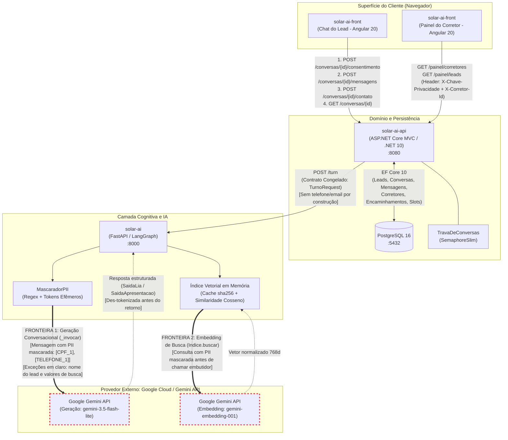

# Solar — Atendimento e Qualificação Inteligente de Leads Imobiliários

> **Hub de Documentação e Arquitetura Central**  
> Repositório de documentação do ecossistema Solar. Para a implementação de cada serviço, consulte os repositórios específicos:
> - [`solar-ai-front`](https://github.com/fvconde/solar-ai-front): Interface do chat do lead (Angular 20) e painel do corretor.
> - [`solar-ai-api`](https://github.com/fvconde/solar-ai-api): API de domínio, persistência relacional e controle de segurança/privacidade (.NET 10).
> - [`solar-ai`](https://github.com/fvconde/solar-ai): Agente conversacional Lia, qualificação e busca vetorial de imóveis (Python / LangGraph).

---

## 1. Problema de Negócio

No mercado imobiliário, o tempo de resposta e a precisão no atendimento inicial são decisivos para a conversão de leads. Corretores humanos gastam horas coletando informações básicas e repetitivas (intenção de compra ou locação, faixa de preço, localização desejada, quantidade de quartos e urgência), enquanto potenciais clientes enfrentam formulários frios ou esperas prolongadas.

O **Solar** é uma plataforma que resolve esse gargalo através da **Lia**, uma corretora virtual conversacional dotada de inteligência artificial. A Lia conduz um diálogo natural, humanizado e focado em consultoria imobiliária:

1. **Recepção e Contexto**: Apresenta-se, esclarece dúvidas iniciais e identifica o objetivo primário (compra, aluguel ou investimento).
2. **Qualificação Progressiva**: Extrai atributos de interesse sem interrogatório mecânico, calculando o nível de maturidade do lead através de uma régua determinística de sinais.
3. **Recomendação Semântica (RAG)**: Consulta um acervo imobiliário combinando filtros duros (orçamento, quartos, região) com similaridade vetorial sobre as descrições dos imóveis.
4. **Agendamento de Visitas e Reuniões**: Oferece horários reais disponíveis de corretores parceiros e registra a intenção de reserva diretamente na conversa.
5. **Encaminhamento Especializado (Handoff)**: Ao atingir o limiar de qualificação ou agendamento, coleta os dados de contato por formulário seguro e transfere o lead ao corretor humano com o perfil mais aderente à trilha e à região.

O sistema atende aos 11 requisitos centrais do enunciado do Tech Challenge: atendimento conversacional, conversa natural, fluxo humanizado, continuidade de conversa, qualificação de leads, agendamento de reuniões, resumo inteligente, dashboard mínimo, identificação de intenção, base simulada de imóveis e follow-up automático.

---

## 2. Arquitetura Geral

O Solar adota uma arquitetura poliglota orientada a serviços desacoplados, combinando o ecossistema de agentes em Python com a robustez corporativa de domínio em C# .NET.

### Diagrama de Arquitetura e Fronteiras de Dados

O diagrama abaixo apresenta os componentes do sistema, suas fronteiras de comunicação e marca explicitamente as **DUAS fronteiras externas** onde dados pessoais transitam para a infraestrutura do Google Gemini (geração de texto e embedding de busca):



### Destaque das Fronteiras Arquiteturais

1. **Front → API**: O cliente navegador comunica-se exclusivamente com a API através de HTTP REST. Em desenvolvimento local, o Angular roda com proxy reverso (`proxy.conf.json`), eliminando complexidades de CORS no navegador.
2. **API → Agente**: Comunicação restrita via `POST /turn`. O contrato é congelado e tipado rigorosamente em DTOs espelhados nos dois repositórios (`Contracts/ContratoTurno.cs` no .NET e `app/contrato.py` no Python). Membros não mapeados são expressamente recusados (`JsonUnmappedMemberHandling.Disallow` e Pydantic `extra="forbid"`).
3. **Agente → Banco**: **Inexistente por projeto.** O agente Python é estritamente *stateless*, não possui connection string e não acessa o PostgreSQL. Toda a persistência, fusão de perfis e histórico é responsabilidade da API.
4. **Agente → Google Gemini (As Duas Fronteiras Externas)**:
   - **Fronteira 1 (Geração de Texto / LLM)**: Executada na chamada `_invocar` em `app/lia/grafo.py` para os nós `responder` e `apresentar`. Toda a mensagem passa pela sanitização do `MascaradorPII`.
   - **Fronteira 2 (Busca Vetorial / Embeddings)**: Executada no método `Indice.buscar` em `app/lia/indice.py`. O texto da consulta do lead é sanitizado pelo `MascaradorPII` antes de ser submetido ao modelo de embedding.

---

## 3. Stack Tecnológica por Componente

| Componente | Repositório | Tecnologias Principais | Papel Arquitetural | Porta Local |
|---|---|---|---|---|
| **Frontend** | `solar-ai-front` | Angular 20 (standalone), TypeScript, Signals, SCSS | Interface web do lead (chat), página de aviso de privacidade e painel operacional do corretor. | `4200` |
| **Backend / API** | `solar-ai-api` | .NET 10, ASP.NET Core MVC (Controllers), EF Core 10, Npgsql | Guardiã do domínio, regras de negócio, persistência relacional, agendamento de slots e controle de privacidade/LGPD. | `8080` |
| **Agente IA** | `solar-ai` | Python 3.12, FastAPI, LangGraph, LangChain Google GenAI, Pydantic v2 | Inteligência conversacional Lia, extração estruturada de intenções, régua de scoring e busca vetorial em memória. | `8000` |
| **Banco de Dados** | Infra Docker | PostgreSQL 16 (imagem oficial Alpine) | Armazenamento relacional persistente de leads, conversas, mensagens, corretores, encaminhamentos e slots. | `5432` |

---

## 4. Como Rodar Localmente

### Pré-requisitos
- [Docker](https://www.docker.com/) e Docker Compose instalados.
- [.NET 10 SDK](https://dotnet.microsoft.com/download) (para execução/testes manuais da API fora de container).
- [Python 3.12+](https://www.python.org/) (para execução/testes manuais do agente).
- [Node.js 22+](https://nodejs.org/) e npm (para o frontend).
- Chave de API do Google Gemini (`GEMINI_API_KEY`).

### Estrutura de Diretórios
Os quatro repositórios devem residir lado a lado sob uma pasta comum `solar/`:
```text
solar/
  ├── solar-ai/          # Agente Python
  ├── solar-ai-api/      # API .NET
  ├── solar-ai-front/    # Frontend Angular
  └── solar-ai-docs/     # Orquestrador Docker Compose e documentação
```

### Passo a Passo

#### 1. Configurar Variáveis de Ambiente
Crie os arquivos `.env` nos respectivos repositórios:

- Em `solar-ai/.env`:
  ```env
  GEMINI_API_KEY=sua_chave_gemini_aqui
  GEMINI_MODEL=gemini-3.5-flash-lite
  GEMINI_EMBEDDING_MODEL=gemini-embedding-001
  GEMINI_TEMPERATURE=0.2
  ```

- Em `solar-ai-api/` (ou configuração no ambiente):
  ```env
  ConnectionStrings__Postgres=Host=localhost;Port=5432;Database=solar;Username=solar;Password=solar
  Seguranca__ChavePrivacidade=chave-secreta-compartilhada-solar
  ```

#### 2. Subir o Backend e Banco via Docker Compose
No repositório `solar-ai-docs`, suba a composição integrada (que inclui os fragments de `solar-ai-api/compose.yml` e `solar-ai/compose.yml`):
```bash
cd solar-ai-docs
docker compose up --build -d
```

Verifique a saúde dos serviços:
- API .NET: `curl http://localhost:8080/health` (deve retornar `status: "up"` e checks do banco).
- Agente Python: `curl http://localhost:8000/health` (deve retornar `status: "up"` e checks do Gemini e índice).

#### 3. Subir o Frontend Angular
O frontend roda fora do Docker Compose em modo de desenvolvimento com hot-reload:
```bash
cd ../solar-ai-front
npm install
npm start
```
Acesse no navegador:
- Chat do Lead: `http://localhost:4200`
- Aviso de Privacidade: `http://localhost:4200/privacidade`
- Painel do Corretor: `http://localhost:4200/painel`

---

## 5. Privacidade e Proteção de Dados (LGPD e Governança)

Esta seção documenta formalmente a governança de dados pessoais, privacidade e garantias de conformidade com a LGPD (Lei Geral de Proteção de Dados - Lei nº 13.709/2018) implementadas no Solar.

### 5.1 Dados Pessoais Coletados e Finalidades
O sistema coleta estritamente os dados necessários para o atendimento e qualificação imobiliária:
1. **Dados de Interação Conversacional**: Mensagens livres trocadas pelo lead com a Lia, incluindo preferências declaradas (tipo de imóvel, número de quartos, faixa de preço, bairro/região, urgência de mudança e expectativa de retorno financeiro para investidores). Finalidade: compreensão da demanda e filtragem semântica de imóveis.
2. **Nome do Lead**: Coletado espontaneamente na conversa ou no formulário de contato. Finalidade: personalização do atendimento e identificação preliminar.
3. **Dados de Contato Direto**: `telefone` e `e-mail`. Coletados exclusivamente através de formulário estruturado na etapa de handoff (`POST /conversas/{id}/contato`). Finalidade: viabilizar o contato comercial pelo corretor humano parceiro.
4. **Registro de Consentimento**: Carimbo de data/hora (`consentimento_em`) e versão do aviso aceito (`versao_aviso_privacidade`). Finalidade: comprovação de conformidade e auditoria LGPD.
5. **Dados Não Coletados (Diretriz de Minimização)**: O sistema não coleta documentos (CPF, RG), dados bancários, renda comprovada ou dados sensíveis (Art. 5º, II da LGPD). O prompt de persona (`prompts/persona.md`) instrui a Lia a recusar expressamente qualquer tentativa de envio de documentos ou dados financeiros pelo usuário.

### 5.2 Bases Legais (LGPD Art. 7º)
- **Consentimento Titular (Art. 7º, I)**: O processamento das mensagens de chat pela IA é condicionado ao consentimento livre, inequívoco e informado, registrado na abertura da sessão via `POST /conversas/{id}/consentimento` antes do envio da primeira mensagem.
- **Execução de Procedimentos Preliminares Relacionados a Contrato (Art. 7º, V)**: O tratamento dos dados de contato, preferências e agendamento de reuniões destina-se a atender a pedidos expressos do próprio titular interessado em adquirir ou locar um imóvel.
- **Legítimo Interesse do Controlador (Art. 7º, IX)**: Monitoramento de métricas operacionais agregadas, prevenção a fraudes e controle de sobrecarga (rate limiting nas rotas da API).

### 5.3 Política de Retenção de Dados (FONTE ÚNICA)
Esta seção constitui a **fonte única da política oficial de retenção de dados da Solar**, provendo o lastro normativo diretamente referenciado no aviso da página `/privacidade` (*"O prazo de guarda e o descarte seguem a política de retenção da Solar"*):

- **Prazo Oficial de Retenção**: Os dados pessoais do lead (perfil, preferências e contatos) e todo o histórico de mensagens e conversas vinculadas são mantidos pelo período de **12 (doze) meses contados da data do último contato** do titular com a plataforma ou com o corretor parceiro.
- **Descarte e Eliminação**: Findo o prazo de doze meses sem novas interações, os dados cadastrais do lead, as mensagens e os registros de atendimento são definitiva e irreversivelmente eliminados.
- **Operação no Tempo Presente vs. Roadmap Técnico**: Em conformidade com o estado real do código, registra-se com transparência que **hoje a eliminação é executada sob demanda** através dos endpoints administrativos da API; **não existe rotina implementada de expurgo automático por TTL** no banco de dados. A implementação de um worker/job em background para expurgo periódico automatizado compõe o roadmap técnico de infraestrutura da plataforma.

### 5.4 Compartilhamento de Dados Pessoais
Os dados pessoais coletados são compartilhados estritamente com os seguintes destinatários:
1. **Corretor Parceiro Atribuído (Compartilhamento Interno/Operacional)**:
   Ao atingir o desfecho de agendamento ou encaminhamento especializado (S-37), a API atribui um corretor por regra determinística e disponibiliza no painel restrito (`/painel/leads`) o nome, score, intenção, região e dados de contato do lead. O compartilhamento visa viabilizar a consultoria humana solicitada pelo lead.
2. **Google Cloud / Gemini API (Operador de Infraestrutura de IA)**:
   As mensagens do lead e os termos de busca vetorial são enviados aos modelos do Google exclusivamente para inferência e geração de embeddings. **Dados de contato (telefone e e-mail) nunca são compartilhados com o Google.**

### 5.5 Camada de Mascaramento de PII e Reversibilidade
Para resguardar dados pessoais antes de qualquer tráfego para a nuvem externa, o agente executa a camada `MascaradorPII` (`app/lia/mascaramento.py`):
- **Detecção**: Expressões regulares identificam padrões de CPF pontuado, telefones formatados, e-mails, CEPs pontuados e padrões numéricos compactos acompanhados de rótulo textual (`cpf 123...`, `whats 119...`).
- **Tokenização Efêmera**: Cada ocorrência é substituída por um token identificador sequencial por turno (`[CPF_1]`, `[TELEFONE_1]`, `[EMAIL_1]`, `[CEP_1]`). O mapa de substituição reside unicamente na memória de execução do turno (`EstadoTurno`), sendo destruído ao final da requisição.
- **Des-tokenização de Saída**: Quando o modelo referencia um token em sua resposta estruturada, a função `_desmascarar_saida` reconstitui o valor original antes de entregar a resposta à API, garantindo que o lead visualize a informação original de forma fluida sem expor o dado ao Google.

### 5.6 As Duas Fronteiras com o Google
O mascaramento atua sistematicamente nas **duas portas de saída** para a Google Gemini API:
1. **Fronteira 1 (Geração Conversacional)**: O método `_invocar` em `grafo.py` envolve as mensagens enviadas ao LLM com `_mensagens_mascaradas`, garantindo que nenhuma PII trafegue no prompt de resposta ou apresentação de imóveis.
2. **Fronteira 2 (Embedding de Busca)**: O método `Indice.buscar` em `indice.py` executa o mascaramento sobre o texto da consulta antes de invocar a chamada de embedding (`embed_query`), impedindo vazamento de dados via vetorização semântica.

### 5.7 Lista de Exceções ao Mascaramento por FUNÇÃO
A separação entre o que é mascarado e o que transita em texto claro é delimitada estritamente por **FUNÇÃO**, e não por sensibilidade abstrata:
1. **`nome` do Lead (desde o S-06)**: Trafega em texto claro no `PerfilLead` (`TurnoRequest.perfil_lead.nome`) e é retornado em `CamposExtraidos`.  
   *Motivo funcional*: Essencial para a condução do diálogo natural e humanizado (a Lia cumprimenta e direciona-se ao titular pelo seu nome).
2. **Valores de Qualificação e Busca (desde o S-34)**: Intenção, faixa de preço mínima/máxima, quantidade de quartos, região/bairro, urgência e expectativa de retorno trafegam em texto claro.  
   *Motivo funcional*: São variáveis de negócio indispensáveis para que o modelo processe a intenção, conduza a qualificação e formule os filtros estruturados do acervo.
3. **Telefone e E-mail — Blindagem Estrutural (S-37)**:  
   Telefone e e-mail **não** são exceções de mascaramento porque **não chegam ao agente por construção arquitetural**. O contrato congelado `POST /turn` não possui campos para esses contatos (fato verificado por reflexão em testes automatizados contra os 7 tipos e 42 campos do espelho). O contato entra por formulário próprio no navegador, vai direto para a API e repousa no Postgres.

### 5.8 Limitações Conhecidas e Aceitas do Mascaramento
Em conformidade com a decisão técnica de produto, foram aceitas duas limitações calculadas para evitar falsos positivos desastrosos:
1. **Número solto de 8 dígitos sem rótulo**: Um CEP sem pontuação e sem a palavra "cep" ao lado (ex: `01310100`) passa em claro.
2. **Número de 11 dígitos sem formatação** que não corresponda a um CPF matematicamente válido (com dígitos verificadores) nem contenha um DDD brasileiro reconhecido: Passa em claro.
*Justificativa*: Fechar agressivamente sequências numéricas de 8 ou 11 dígitos tokenizaria indevidamente valores de imóveis (ex: `1.200.000` sem formatação), metragens ou códigos de referência imobiliária, inviabilizando a qualificação do turno.

### 5.9 Direito de Eliminação do Titular (LGPD Art. 18, VI)
Esta seção estabelece o procedimento operacional que dá lastro à declaração expressa na página `/privacidade` (*"Você pode solicitar a eliminação dos dados associados ao seu lead"*):

- **Canal de Recebimento do Pedido**: O pedido de eliminação formulado pelo titular é recebido pelo **corretor parceiro ou pelo atendimento humano**, atores que já integram o fluxo operacional do sistema desde o S-37.
- **Execução Administrativa**: Ao receber a solicitação legítima do titular, o operador aciona a exclusão diretamente nos endpoints protegidos da API, autenticando-se via cabeçalho administrativo (`X-Chave-Privacidade` / `X-Admin-Key` / `Bearer`). Não há canal de e-mail dedicado, formulário público ou encarregado de dados (DPO) nomeado nesta fase.
- **Mecanismos Técnicos de Eliminação no Banco**:
  - `DELETE /leads/{id}`: Elimina definitivamente o lead e aciona a remoção em cascata (`ON DELETE CASCADE`) de todas as conversas, mensagens e encaminhamentos vinculados no PostgreSQL. Eventuais horários agendados têm o vínculo desfeito (`slots.lead_id` volta a `NULL`).
  - `DELETE /conversas/{id}?excluirLead=true`: Localiza o lead proprietário da conversa e executa a exclusão integral do titular e de todo o seu histórico em cascata.
  - `DELETE /conversas/{id}?excluirLead=false`: Remove exclusivamente a conversa indicada e suas mensagens, mantendo o cadastro do lead preservado para eventuais outras interações.

### 5.10 Regime Alvo (Tier Pago) vs. Desenvolvimento
- **Regime Declarado**: Tanto o aviso curto de consentimento na abertura quanto a página `/privacidade` afirmam expressamente que as mensagens dos usuários não são utilizadas pelo provedor de inteligência artificial para treinar ou aprimorar modelos.
- **Pré-condição Operacional**: O ambiente de desenvolvimento opera sobre o tier gratuito do Google Gemini. A contratação e ativação do **tier pago da Gemini API** (pré-pago comercial com faturamento ativo) constitui **pré-condição técnica e jurídica indispensável** para que essa declaração seja verdadeira em ambiente de produção e uso real (incluindo gravações de demonstração).

### 5.11 O Que Seria Diferente em Produção
Em uma operação comercial definitiva em larga escala, as seguintes evoluções de segurança e privacidade devem ser adotadas:
1. **Gerenciamento Centralizado de Segredos**: Migração das chaves de API e strings de conexão para serviços gerenciados (Azure Key Vault, AWS Secrets Manager ou GCP Secret Manager), eliminando variáveis locais.
2. **Segregação de Papéis e Credenciais**: Separação estrita entre a credencial de visualização do painel do corretor e a credencial administrativa de eliminação LGPD (atualmente unificadas sob `Seguranca:ChavePrivacidade`).
3. **Autenticação e RBAC Corporativo**: Implementação de autenticação baseada em padrões abertos (OAuth2 / OpenID Connect / JWT) com controle de acesso baseado em papéis (RBAC) para corretores e administradores.
4. **Portal do Titular Self-Service**: Interface web onde o próprio titular pode solicitar e acompanhar a exclusão ou portabilidade de seus dados via validação em duas etapas (e-mail/SMS OTP).
5. **Automação Periódica de Expurgo (TTL Worker)**: Serviço agendado em background para expurgo automático de conversas e leads inativos conforme os prazos de retenção estabelecidos.
6. **Observabilidade e Trilha de Auditoria**: Implementação de rastreamento distribuído (OpenTelemetry) com logs de auditoria imutáveis para operações de leitura e expurgo de dados pessoais.

---

## 6. Decisões de Arquitetura e Trade-offs

As principais decisões técnicas consolidadas no projeto, registradas no histórico do `ESTADO.md` e no vault `Solar Brain/`:

1. **Arquitetura Poliglota (.NET + Python)**: LangGraph é o estado da arte para orquestração de grafos de agentes cognitivos, enquanto .NET 10 oferece alta tipagem, performance e robustez corporativa para regras de domínio e persistência relacional.
2. **Agente Python Stateless**: O agente não conhece o banco de dados e não retém estado entre requisições. A API serializa os turnos (`TravaDeConversas`), envia o histórico necessário e persiste as respostas, mantendo a superfície de acoplamento mínima.
3. **Contrato Congelado do `POST /turn`**: Definido por DTOs estritos com recusa ativa de campos desconhecidos. Erros de incompatibilidade quebram imediatamente no primeiro turno (fail-fast), impedindo corrupção silenciosa de dados.
4. **Índice Vetorial em Memória com Cache sha256**: A base estática de 80 imóveis é vetorizada no boot em memória RAM. Os vetores residem versionados em `data/embeddings.json` e são revalidados via hash sha256 do corpus, permitindo boot instantâneo sem consumo de rede ou cota da API.
5. **Scoring de Lead por Régua Determinística**: O score (0 a 100) e a escolha da próxima lacuna de qualificação são calculados por uma tabela estrita de sinais no Python, garantindo 100% de explicabilidade no pitch e eliminando alucinações de pontuação pelo LLM.
6. **Agenda na Requisição e Slots no Banco**: Em vez de consultar APIs de calendário externas, a agenda é gerada dinamicamente no boot da API (`AgendaInicial`) em dias úteis e enviada no payload do turno para que o agente ofereça apenas horários reais.

---

## 7. Roadmap e Cortes Justificados

Recursos avaliados e deliberadamente postergados ou cortados do escopo da POC, com as respectivas justificativas técnicas e de negócio:

- **pgvector e Base Dinâmica (Card S-35)**:
  - *Motivo do corte*: A base simulada atual é estática (80 imóveis) e carrega em milissegundos em RAM. Migrar para pgvector no Postgres exigiria criar rotinas de ingestão dinâmica de catálogo e lidar com duas armadilhas críticas mapeadas no S-35: concorrência transacional de escrita/atualização de vetores e recalibração de índices HNSW/IVFFlat sob dados instáveis.
- **WhatsApp Oficial**:
  - *Motivo do corte*: Custo estimado de 18h de integração contra 4h do chat web. Além disso, as diretrizes da API do WhatsApp proíbem o envio de mensagens ativas fora da janela de 24 horas sem templates pré-aprovados pagos, o que inviabilizaria o teste de follow-up proativo automático.
- **Google Calendar**:
  - *Motivo do corte*: Exigiria fluxo de consentimento OAuth2 por corretor e tratamento de indisponibilidade externa. A tabela interna de `slots` com reserva condicional transacional atende integralmente ao objetivo de validação do produto com zero atrito de integração.
- **Integração com CRM Externo (HubSpot/Salesforce)**:
  - *Motivo do corte*: Substituída com vantagens pedagógicas pelo Painel do Corretor interno (`/painel`), eliminando dependência de contas comerciais de terceiros e expondo diretamente os dados qualificados da API.
- **Voice AI / Atendimento por Voz**:
  - *Motivo do corte*: Custo de implementação elevado (15h+) e complexidade desproporcional de transcrição/latência, sem agregação de valor direta aos 11 requisitos centrais do enunciado.
- **Observabilidade Completa Distribuída**:
  - *Motivo do corte*: O setup de coletores OpenTelemetry, Prometheus e Jaeger consumiria esforço crítico de entrega. Foi mantido logging estruturado e sanitizado com endpoints de `/health` padronizados.
- **Portal Self-Service de Exclusão pelo Titular (Card Novo)**:
  - *Motivo do corte*: Decidido pelo usuário como card novo independente a ser planejado para o backlog de produto. Foi mantido fora desta janela por exigir código de aplicação e componentes de frontend novos, o que violaria o escopo estritamente textual e documental deste card (S-30). O atendimento ao direito do titular no tempo presente é assegurado via canal humano (corretor/atendimento) e endpoints administrativos da API.
- **Componentes de Machine Learning Clássico**:
  - *Motivo do corte*: O scoring e a qualificação são plenamente resolvidos pela régua determinística e pelo extrator de saída estruturada do LLM. Treinar um classificador supervisionado sobre base sintética consumiria horas sem gerar ganho prático mensurável.

---

## 8. Navegação e Documentação dos Repositórios

Para instruções específicas de cada componente, arquitetura interna e comandos de teste, consulte:
- [Repositório e Documentação da API (.NET 10)](https://github.com/fvconde/solar-ai-api)
- [Repositório e Documentação do Agente Lia (Python / LangGraph)](https://github.com/fvconde/solar-ai)
- [Repositório e Documentação do Frontend (Angular 20)](https://github.com/fvconde/solar-ai-front)
